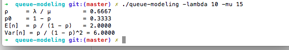

Queue-Modeling - WIP 
==============

Is a command-line tool to automate the task of having to calculate
queue theory formulas

receives as input  λ and μ
and outputs the formula and answer

example
=======

./queue-modeling -lambda 10 -mu 15 

ρ  = λ / μ  = 0.6700 

p0 = 1 - p  = 0.3333

p / (1 - p) = 2.0303

Todo
==========
- [ ] Add all formulas from M/M/1 Queue type
- [ ] Output to file
- [ ] Add formulas from other kinds of queue types
- [ ] Add filter to output only a few formulas
